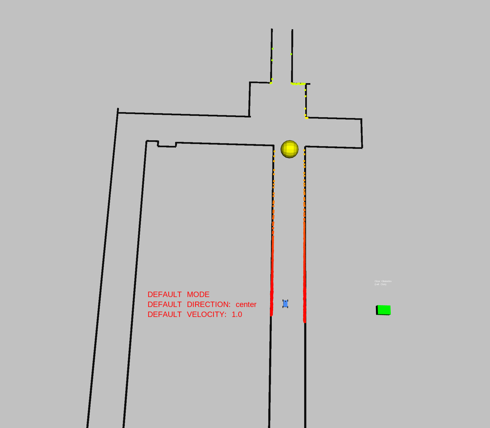

## Instructions

1. Check the params.yaml to change the wall following mode, currently its default DIRECTION: 'center'
2. To set KP, KD again check params.yaml
3. To change default velocity, max velocity check params.yaml.
4. Demo videos are provided in Videos/
5. Make sure you have the f110-skeletons-spring2020 race simulator also compiled in the catkin_ws

## Run after compiling workspace
* For Pure wall following
``  $ roslaunch virtualfastkeyboardfurious_wall_following pure_wall_following.launch 
``

* For Instruction Following
``  $ roslaunch virtualfastkeyboardfurious_wall_following instruction_wall_following.launch 
``
  press n after roslaunching.

  
